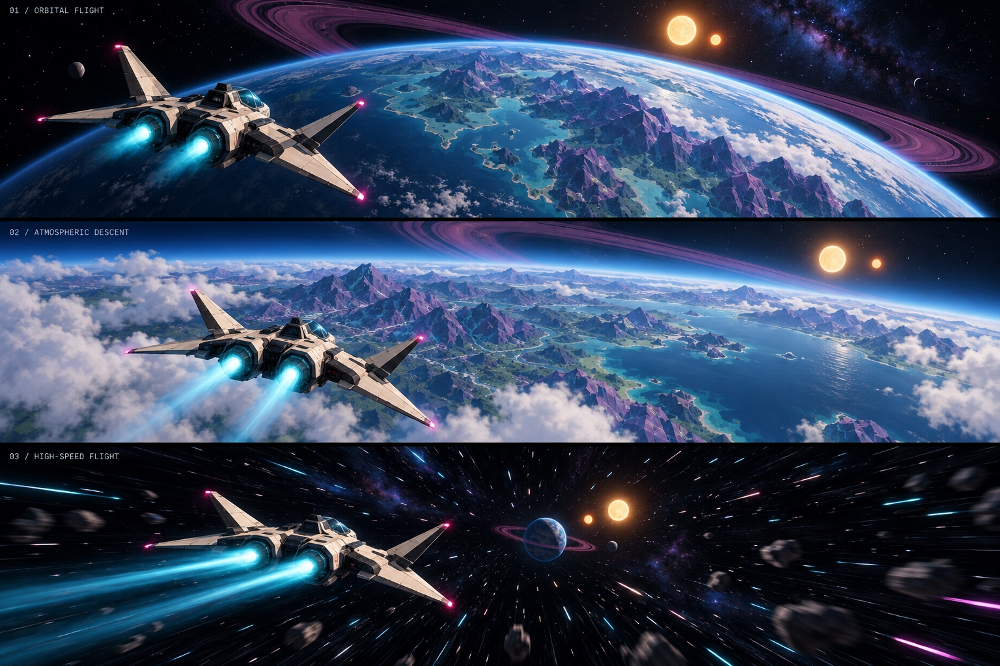

# Void Explorer

Concept art and a staged plan for a procedural space exploration game. Current stage: visual development. Game implementation comes later.

- [Art direction](art/ART_DIRECTION.md)
- [Full build sequence](BUILD_PLAN.md)
- [Image generation prompt](art/concepts/flight-study-v1.prompt.md)

References: [Live game](https://void-explorer.openai.chatgpt.site/), [Void Explorer showcase and build stages](https://developers.openai.com/showcase/void-explorer), and [Building games with Astra](https://developers.openai.com/blog/how-to-build-games-with-astra).

This repository starts a new implementation following the published workflow; it does not contain the original game's source or assets.
